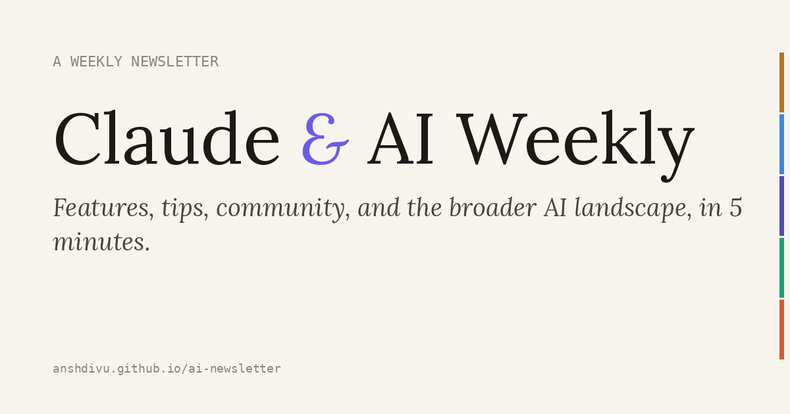

# Claude & AI Weekly

> A weekly newsletter on Claude and the broader AI landscape. Researched, written, designed, and published end-to-end by a scheduled Claude agent. Zero human time per week once running.

**[Live archive](https://anshdivu.github.io/ai-newsletter/)** · **[Latest issue](https://anshdivu.github.io/ai-newsletter/weekly/004.html)** · MIT licensed

<a href="https://anshdivu.github.io/ai-newsletter/">
  
</a>

## What it is

Every Friday morning a Claude agent runs unattended on a schedule. It pulls the past seven days of news across eight web-search topics, drafts the next issue across five sections, generates a 1200×630 social preview card, updates the previous issue's navigation, refreshes the archive landing page, and pushes everything to this repo. GitHub Pages picks it up about a minute later.

The interesting bit isn't the writing. It's the pipeline.

## How it works

```
Friday 9am local
      │
      ▼
┌─────────────────────────────────────────────┐
│  Scheduled Claude agent (cron 0 9 * * 5)    │
└─────────────────────────────────────────────┘
      │
      ▼
   read PAT from ~/.ai-newsletter/token (chmod 600, never committed)
      │
      ▼
   git clone fresh into /tmp
      │
      ▼
   determine next issue number (max(weekly/*.html) + 1)
      │
      ▼
   8 parallel WebSearch queries → tips, releases, community, landscape
      │
      ▼
   draft 5 sections of HTML against the previous issue's template
      │
      ▼
   render 1200×630 OG preview with Pillow (Lora serif + section accent stripe)
      │
      ▼
   update previous issue nav (left/right arrows)
      │
      ▼
   update index.html (new entry promoted to .latest)
      │
      ▼
   commit · push · poll Pages API until build="built" · GET the live URL
      │
      ▼
   report URLs back to the user
```

Total human input per week: **zero**.

## Stack

| Layer | Tooling |
|---|---|
| Site | Static HTML + CSS. No build step, no framework, no bundler. |
| Hosting | GitHub Pages, deploy-from-branch |
| Theming | CSS custom properties + `:has()` for section-scoped accent colors. Light/dark with system-preference detect + localStorage override. |
| Typography | Newsreader (serif headlines) + Inter (body) + JetBrains Mono (tags) — all from Google Fonts |
| OG images | Pillow + Lora · 1200×630 PNG per issue |
| Social meta | Full `og:*`, `twitter:*`, `<link rel="canonical">` block |
| Automation | Cowork scheduled task, GitHub fine-grained PAT, GitHub Pages REST API |
| Auth | PAT scoped to one repo with `Contents:RW`, `Pages:RW`, `Administration:RW`, `Metadata:R` only |

## Craft notes

- **Section-scoped accent colors** via `--section-accent` set by `.section:has(.tag-tips)` etc. Hover states everywhere inherit the section's color without per-section overrides.
- **Responsive font sizing** uses `clamp(min, fluid, max)` across body, headings, and component-level text. No media-query font overrides.
- **Theme toggle** applies persisted preference *before* paint via an inline `<script>` in `<head>`, so dark-mode users never see a flash of light theme.
- **Issue navigation** at the bottom of every issue: ←Previous · Archive · Next→. First/last issues collapse one side to a `nav-empty` slot. Mobile reflows to two columns with archive promoted to the top row.
- **Backward-compat 404** — old `/claude-ai-weekly-N.html` URLs (the original naming pattern from issues 1-3) auto-redirect to the new `/weekly/NNN.html` paths via a single `404.html` handler. No per-file stub clutter in the repo tree.
- **Every callout bullet links to a primary source.** No dead text. Verified across all four issues — 68 bullets, 68 working links.

## Repo structure

```
.
├── index.html          # Archive landing page (lists all issues)
├── 404.html            # Old-URL redirects + general not-found
├── weekly/
│   ├── 001.html        # One file per issue, self-contained
│   ├── 002.html
│   ├── 003.html
│   └── 004.html
├── og/
│   ├── 001.png         # 1200×630 social preview per issue
│   ├── 002.png
│   ├── 003.png
│   ├── 004.png
│   └── newsletter.png  # Landing-page social preview
├── LICENSE
└── README.md
```

Each `weekly/NNN.html` is a single self-contained file. No shared CSS, no JS bundle, no external state. Open one offline and the toggle, hover states, OG meta, everything still works.

## Author

[@anshdivu](https://github.com/anshdivu). Idea, design, and the scheduled-task harness. Claude does the weekly writing.

## License

[MIT](LICENSE).
